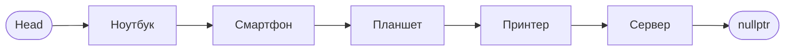
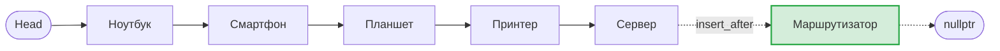

# Звіт про виконання практичної роботи
**Виконала:** студентка 4 курсу Винарчик Софія Степанівна  
**Варіант:** 1  

---

## Тема роботи
Опрацювання однозв’язних списків у мові програмування C++ за допомогою контейнера `std::forward_list`.

## Мета роботи
Набути практичних навичок створення, ініціалізації та опрацювання однозв’язних списків `std::forward_list<string>` у мові C++; навчитися використовувати ітератори для навігації по списку, а також виконувати операції додавання, видалення, пошуку та вставки елементів.

---

## Варіант завдання (Варіант 1)

| № | Тематика списку | Початкові елементи | Елемент для пошуку | Елемент для вставки |
| :-: | :--- | :--- | :--- | :--- |
| 1 | Технологічні пристрої | Ноутбук, Смартфон, Планшет, Принтер, Сервер | Сервер | **Маршрутизатор** |

---

## Візуалізація структури однозв’язного списку

Однозв'язний список (`std::forward_list`) складається з вузлів, кожен з яких містить значення (інформаційне поле) та вказівник на наступний елемент списку. Останній елемент вказує на `nullptr` (кінець списку).

### 1. Початковий стан списку (Завдання 1, 3, 4):
`[Head] ➔ [Ноутбук] ➔ [Смартфон] ➔ [Планшет] ➔ [Принтер] ➔ [Сервер] ➔ nullptr`



### 2. Додавання та видалення елементів на початку (Завдання 2):
* **Після `push_front("Маршрутизатор")` та `push_front("Монітор")`:**  
  `[Head] ➔ [Монітор] ➔ [Маршрутизатор] ➔ [Ноутбук] ➔ nullptr`
* **Після `pop_front()`:**  
  `[Head] ➔ [Маршрутизатор] ➔ [Ноутбук] ➔ nullptr`

### 3. Вставка елемента після заданого (Завдання 5 — `insert_after`):
`[Head] ➔ [Ноутбук] ➔ [Смартфон] ➔ [Планшет] ➔ [Принтер] ➔ [Сервер] ➔ [Маршрутизатор] ➔ nullptr`



---

## Виконання завдань

### Завдання 1. Ініціалізація та виведення елементів
**Умова:**
1. Створити однозв’язний список `std::forward_list<string>` відповідно до заданого варіанта.
2. Вивести всі елементи списку на екран за допомогою ітератора.

**Програмний код:**
```cpp
#include <iostream>
#include <forward_list>
#include <string>
using namespace std;
int main()
{
forward_list<string>
devices = { "Ноутбук", "Смартфон", "Планшет", "Принтер", "Сервер" };
cout << "Технологічні пристрої:" << endl;
for (string device : devices)
    {
    cout << device << endl;
    }
return 0;
}
```

**Результат виконання:**
```text
Технологічні пристрої:
Ноутбук
Смартфон
Планшет
Принтер
Сервер
```

**Скріншот роботи програми:**
> *

> 
*

---

### Завдання 2. Додавання та видалення елементів
**Умова:**
1. Створити однозв’язний список `std::forward_list<string>`, використовуючи перший елемент із набору початкових елементів відповідно до свого варіанта.
2. Додати на початок списку два нові елементи, обрані самостійно відповідно до тематики свого варіанта, використовуючи метод `push_front()`.
3. Вивести всі елементи списку на екран.
4. Видалити перший елемент списку за допомогою методу `pop_front()`.
5. Повторно вивести всі елементи списку на екран.

**Програмний код:**
```cpp
#include <iostream>
#include <forward_list>
#include <string>
using namespace std;
int main()
{
forward_list<string> devices = { "Ноутбук" };
devices.push_front("Маршрутизатор");
devices.push_front("Монітор");
cout << "Список пристроїв:" << endl;
for (string device : devices)
    {
    cout << device << endl;
    }
devices.pop_front();
cout << endl;
cout << "Після видалення першого пристрою:" << endl;
for (string device : devices)
    {
    cout << device << endl;
    }
return 0;
}
```

**Результат виконання:**
```text
Список пристроїв:
Монітор
Маршрутизатор
Ноутбук

Після видалення першого пристрою:
Маршрутизатор
Ноутбук
```

**Скріншот роботи програми:**
> *(Перетягніть сюди скріншот виконання Завдання 2 у вікні редагування GitHub)*

---

### Завдання 3. Знаходження та перевірка наявності елемента
**Умова:**
1. Створити однозв’язний список `std::forward_list<string>` із початкових елементів відповідно до свого варіанта.
2. За допомогою ітератора перевірити наявність у списку елемента для пошуку, заданого у своєму варіанті.
3. Вивести результат перевірки на екран: «Елемент знайдено» або «Елемент не знайдено».

**Програмний код:**
```cpp
#include <iostream>
#include <forward_list>
#include <string>
using namespace std;
int main()
{
    forward_list<string> devices = 
    {
        "Ноутбук",
        "Смартфон",
        "Планшет",
        "Принтер",
        "Сервер"
    };
string searchDevice;
cout << "Введіть назву пристрою для пошуку"<<endl;
cin>>searchDevice;
auto it = devices.begin();
while (it != devices.end())
    {
        if (*it == searchDevice)
        {
            cout << "Елемент знайдено";
            break;
        }

        ++it;
    }
    if (it == devices.end())
    {
        cout << "Елемент не знайдено";
    }
    return 0;
}
```

**Результат виконання:**
```text
Введіть назву пристрою для пошуку
Сервер
Елемент знайдено
```

**Скріншот роботи програми:**
> *(Перетягніть сюди скріншот виконання Завдання 3 у вікні редагування GitHub)*

---

### Завдання 4. Підрахунок кількості символів
**Умова:**
1. Створити однозв’язний список `std::forward_list<string>` із початкових елементів відповідно до свого варіанта.
2. За допомогою ітератора переглянути всі елементи списку.
3. Обчислити загальну кількість символів у назвах усіх елементів списку.
4. Вивести результат на екран.

**Програмний код:**
```cpp
#include <iostream>
#include <forward_list>
#include <string>
using namespace std;
int main()
{
    forward_list<string> devices = 
    {
        "Ноутбук",
        "Смартфон",
        "Планшет",
        "Принтер",
        "Сервер"
    };
int sum = 0;
for (string device : devices)
{
    sum = sum + device.length();
}
cout << "Загальна кількість символів: " << sum;
    return 0;
}
```

**Результат виконання:**
```text
Загальна кількість символів: 70
```

**Скріншот роботи програми:**
> *(Перетягніть сюди скріншот виконання Завдання 4 у вікні редагування GitHub)*

---

### Завдання 5. Вставка елемента у список
**Умова:**
1. Створити однозв’язний список `std::forward_list<string>` відповідно до заданого варіанта.
2. За допомогою ітератора знайти у списку заданий елемент. Якщо елемент знайдено, вставити після нього новий елемент, використовуючи метод `insert_after()`. Якщо заданий елемент відсутній у списку, вивести відповідне повідомлення.
3. Після виконання операції вивести оновлений список.

**Програмний код:**
```cpp
#include <iostream>
#include <forward_list>
#include <string>
using namespace std;
int main()
{
    forward_list<string> devices = { "Ноутбук", "Смартфон", "Планшет", "Принтер", "Сервер"};
    string searchElement = "Сервер";
    string newElement = "Маршрутизатор";

    auto it = devices.begin();
    while (it != devices.end())
    {
        if (*it == searchElement)
        {
            // Вставка нового елемента після знайденого
            devices.insert_after(it, newElement);
            break;
        }

        ++it;
    }

    for (auto i = devices.begin(); i != devices.end(); ++i)
    {
        cout << *i << " ";
    }

    return 0;
}
```

**Результат виконання:**
```text
Ноутбук Смартфон Планшет Принтер Сервер Маршрутизатор 
```

**Скріншот роботи програми:**
> *(Перетягніть сюди скріншот виконання Завдання 5 у вікні редагування GitHub)*

---

## Висновок
Під час виконання практичної роботи було опановано роботу з шаблонним класом однозв’язного списку `std::forward_list<string>` стандартної бібліотеки шаблонів (STL) мови програмування C++. Було реалізовано алгоритми ініціалізації списку, перебору його елементів за допомогою діапазонного циклу `for` та ітераторів, додавання нових вузлів на початок списку методом `push_front()` і видалення першого вузла методом `pop_front()`. Також було відпрацьовано лінійний пошук заданого елемента через ітератор, підрахунок сумарної довжини рядкових елементів за допомогою методу `.length()` та цільову вставку нового елемента після знайденої позиції за допомогою методу `insert_after()`.
